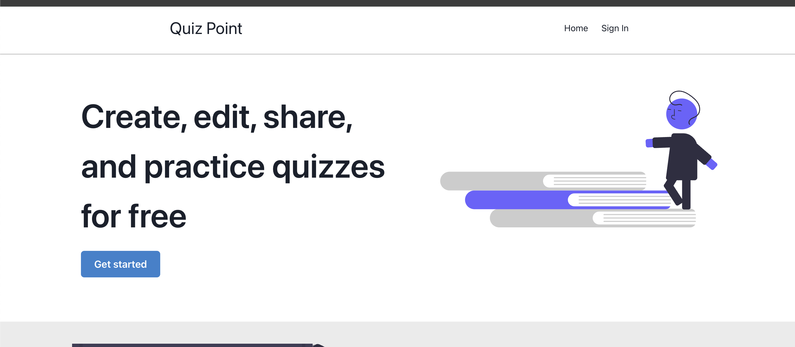
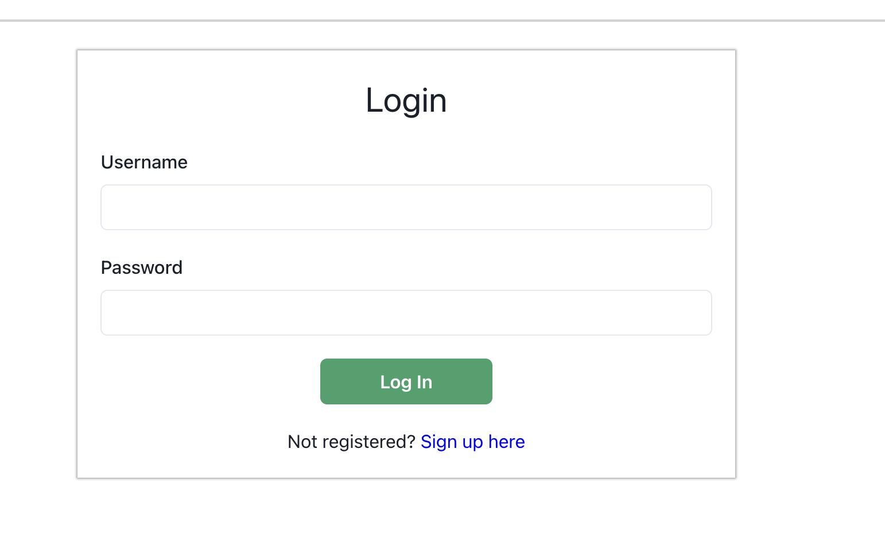
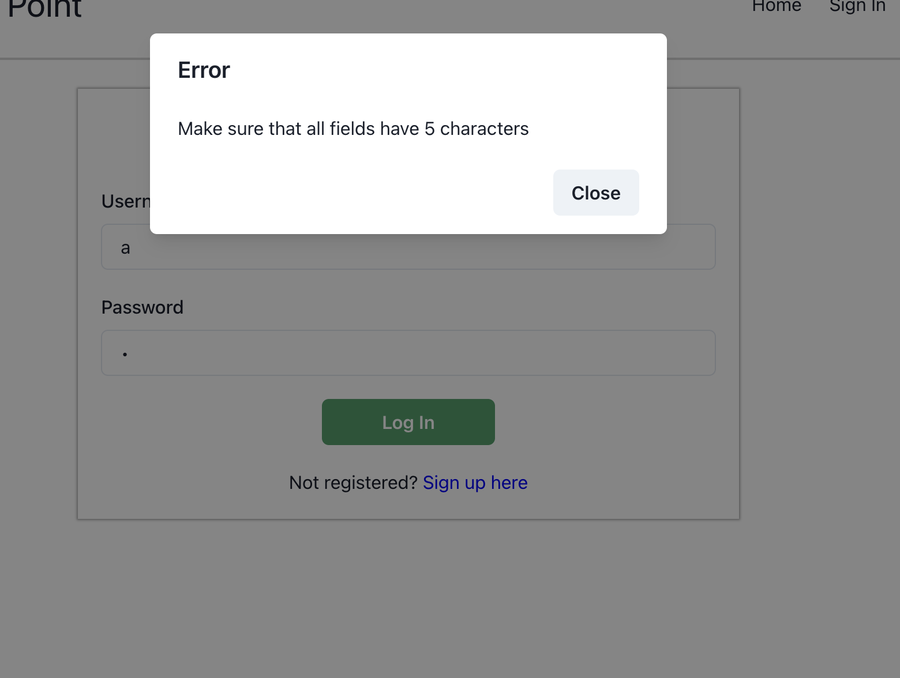
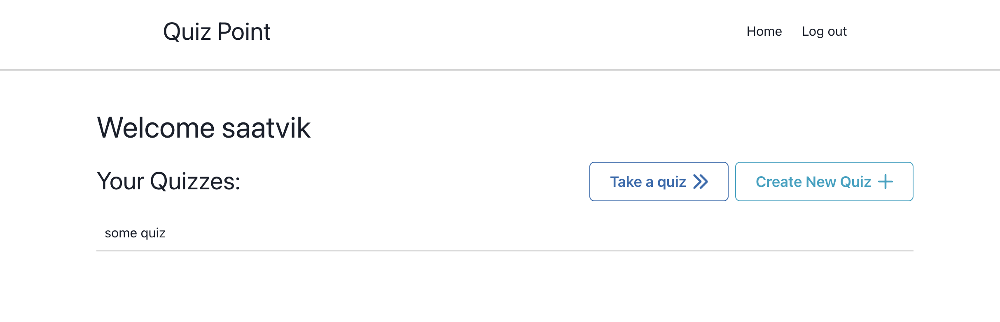
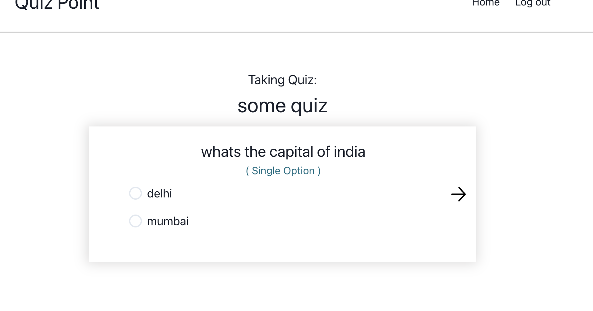
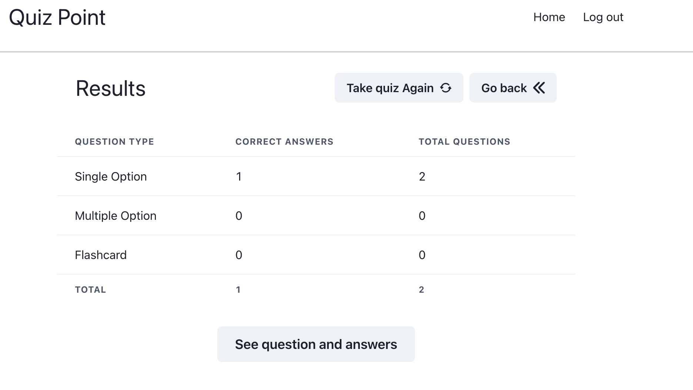

# Quiz Point

### Run Locally:

1. Have docker installed
2. `docker compose build`
3. `docker compose up`
4. Go to `localhost:5001`

## Overview

This web application allows users to create and take a quiz in their browser. The quizzes can have multiple types 
of questions, like:
* Single Option 
* Multiple Options 
* Flashcard type

They can take the quiz and see their performance after they are done with it. They can also 
edit the quiz, and delete it if they wish. 

### Sharing 

Users can make their any of their quizzes public, and share the quiz code to others. 
Other users can take these quizzes with or without signing in.

## Technologies Used

* React 
* Node JS and Express for Back End 
* MongoDB for data storage 
* Chakra UI as the UI Framework

## Images

### Home page

### Home on mobile

### Login

### Validation error

### User's quizzes

### Taking quiz

### Quiz results

